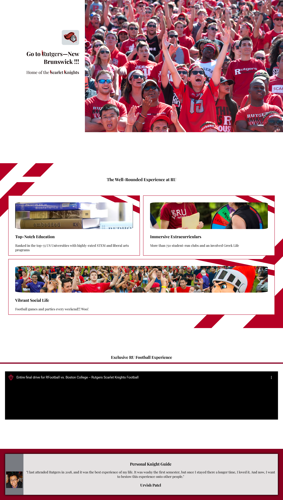
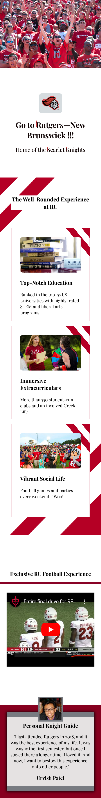

# Personal Rutgers Showcase

Ever been to Rutgers University? No? Well here is a brochure highlighting the main features of the University.

## Table of contents

- [Overview](#overview)
  - [The challenge](#the-challenge)
  - [Screenshot](#screenshot)
  - [Links](#links)
- [My process](#my-process)
  - [Built with](#built-with)
  - [What I learned](#what-i-learned)
  - [Continued development](#continued-development)
  - [Useful resources](#useful-resources)
- [Author](#author)
- [Acknowledgments](#acknowledgments)

## Overview

This project is a personalization of Scrimba's Hometown Homepage project.

### The challenge

Utilize classes, flexbox, background-image, and a color palette.

### Screenshot




### Links

Live Site: [https://take-me-to-rutgers.netlify.app/](https://take-me-to-rutgers.netlify.app/)

## My Process

Build the entire HTML page, then develop the CSS.

### Built with

This project was built with HTML and CSS.

### What I learned

```javascript
<meta name="viewport" content="width=device-width, initial-scale=1" />
```

The above viewport meta tag is necessary to make the webpage appear as intended on mobile devices.

Secondly, gained first-hand practice on implementing UI fundamentals.

### Continued development

- [ ] Make the UI design better at wider screen sizes

### Useful Resources

## Author

Don't have any other personal links rather than this GitHub account.

## Acknowledgments

None